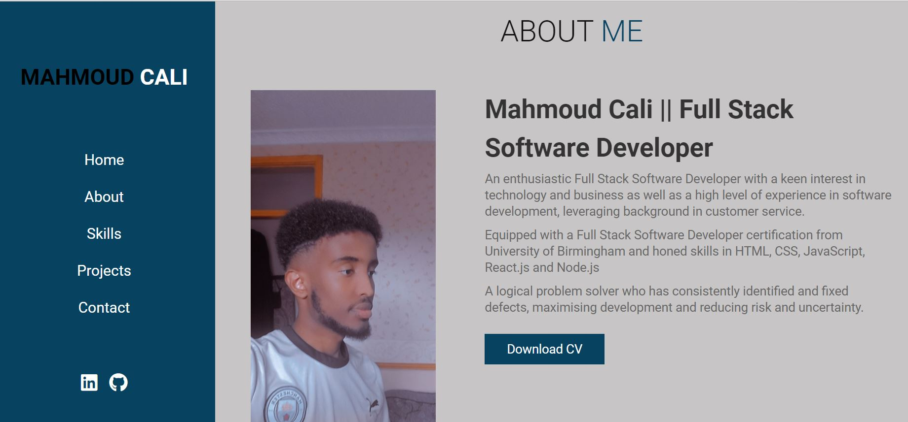

# personal-portfolio
# Description 
A responsive portfolio that provides professional information about me and and presents a showcase of my work.

## Links
Repository link: https://github.com/Mahmoudcali02/personal-portfolio

Deployed link: https://mahmoudcali02.github.io/personal-portfolio/#index.html

## Screeenshots 

## References and tutorials used
Bootstrap: https://getbootstrap.com/

W3schools: https://www.w3schools.com/
