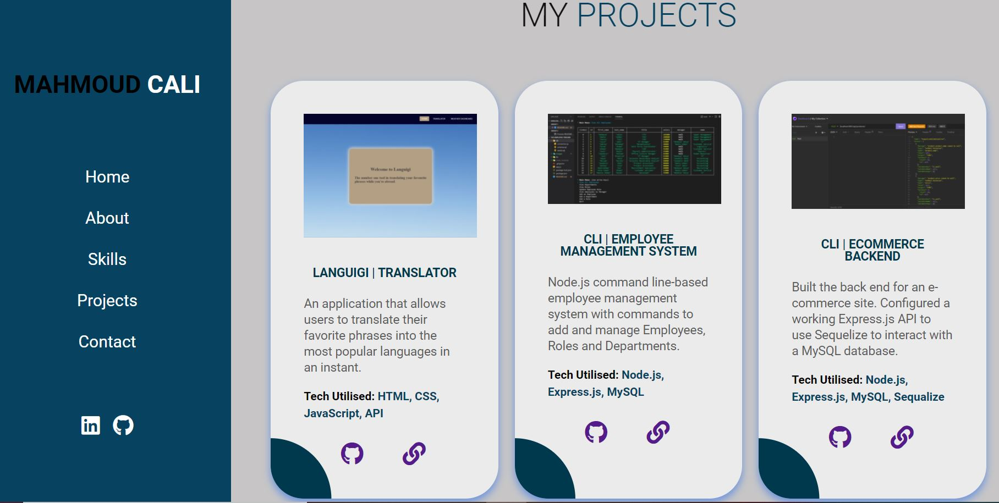

# personal-portfolio
# Description 
This application is a portfolio which presens a showcase of my work and a section about who I am and my background.

## Notice Update
This application is updated and some projects are being added to it.
Added links to my social accounts and polished my Ui design
There is going to be more projects on the way and I am currently learning and developing new projects. 

#### It consists of 5 sections which are: 
* Home section 
* About section 
* Skills section 
* Projects section 
* Contact section 

## Usage 
The user can access different sections of the application by using the nav-bar at the top 

which has links to all the sections of the web-page.

## Links
Repository link: https://github.com/Mahmoudcali02/personal-portfolio

Deployed link: https://mahmoudcali02.github.io/personal-portfolio/#index.html

## Screeenshots 

## References and tutorials used
Bootstrap: https://getbootstrap.com/

W3schools: https://www.w3schools.com/
